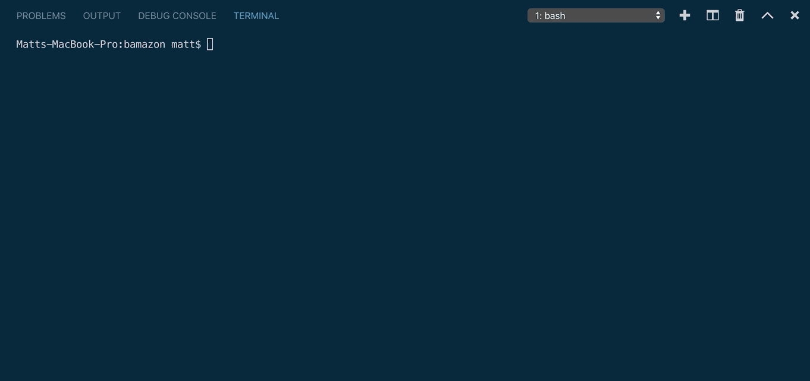

# Bamazon

Bamazon is a simple amazon-type application that utilizes node to perform CRUD statements on a local MySQL database.

There are several different interfaces offered by this application. Each interface has different functionalities as follows:

### Bamazon Customer

Running 'node bamazonCustomer' will allow the user to view a list of the items currently for sale and place an order based on the items unique ID. The transaction will only go through if there are enough of the item currently in stock

### Bamazon Manager

Running 'node bamazonManager' presents the user with the manager view which gives them the following 4 functionalities:

##### View Products for Sale

##### View Low Inventory

##### Add to Inventory

##### Add New Product

## Bamazon Supervisor

running 'node bamazonSupervisor' allows the user to view the total sales and profitability of each department.

